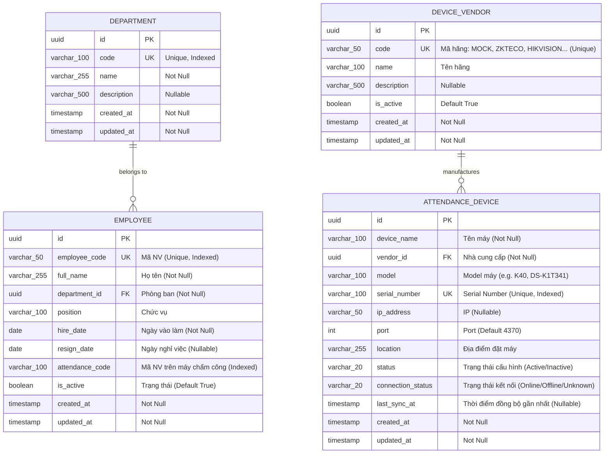

# Sprint 1 — Architecture & Technical Design

> Scope: **Employee Module + Device Module (with Device Vendor) + Mock Device Connector**

---

## 1. High-Level Architecture & Clean Architecture Boundaries

```
                               ┌────────────────────────────────────────┐
                               │       Frontend (Next.js 15)           │
                               │  - /employees (Management & Form)     │
                               │  - /devices (Device & Vendor UI)       │
                               └──────────────────┬─────────────────────┘
                                                  │ HTTP / REST API
                                                  ▼
                               ┌────────────────────────────────────────┐
                               │       Attendance.Api (.NET 10)         │
                               │  - EmployeesController                 │
                               │  - DevicesController                   │
                               │  - DeviceVendorsController             │
                               └──────────────────┬─────────────────────┘
                                                  │
                                                  ▼
                               ┌────────────────────────────────────────┐
                               │     Attendance.Application Layer       │
                               │  - IEmployeeService, IDeviceService    │
                               │  - IDeviceConnector,                   │
                               │    IDeviceConnectorFactory             │
                               │  - IAppDbContext interface             │
                               │  - DTOs & Validation Contracts         │
                               └───────▲──────────────────────▲─────────┘
                                       │                      │
                  ┌────────────────────┴────────┐   ┌─────────┴─────────────────────┐
                  │                             │   │                               │
┌─────────────────┴─────────────┐ ┌─────────────┴───┴──────────┐ ┌─────────────────┴─────────────┐
│    Attendance.Domain Layer    │ │ Attendance.Infrastructure  │ │    Attendance.Worker          │
│ - Employee, Department        │ │ - AppDbContext (EF Core)   │ │ - Background service skeleton │
│ - AttendanceDevice            │ │ - MockDeviceConnector      │ └───────────────────────────────┘
│ - DeviceVendor                │ │   (Adapter implementation) │
│ - Enums (DeviceStatus,        │ │ - DeviceConnectorFactory   │
│   ConnectionStatus)           │ │ - PostgreSQL Migrations    │
└───────────────────────────────┘ └─────────────┬──────────────┘
                                                │
                                                ▼
                               ┌────────────────────────────────────────┐
                               │        PostgreSQL 16 Database         │
                               │  - departments                         │
                               │  - employees                           │
                               │  - device_vendors                      │
                               │  - attendance_devices                  │
                               └────────────────────────────────────────┘
```

---

## 2. Database Design & Entity Relationships (ERD)

### 2.1 Entity Relationship Diagram (ERD)



### 2.2 Database Indexes & Constraints
- `departments`:
  - `PK_departments` on `id`
  - `IX_departments_code` UNIQUE on `code`
- `employees`:
  - `PK_employees` on `id`
  - `IX_employees_employee_code` UNIQUE on `employee_code`
  - `IX_employees_attendance_code` on `attendance_code`
  - `IX_employees_department_id` on `department_id`
  - `FK_employees_departments` on `department_id` $\rightarrow$ `departments(id)` (ON DELETE RESTRICT)
- `device_vendors`:
  - `PK_device_vendors` on `id`
  - `IX_device_vendors_code` UNIQUE on `code`
- `attendance_devices`:
  - `PK_attendance_devices` on `id`
  - `IX_attendance_devices_serial_number` UNIQUE on `serial_number`
  - `IX_attendance_devices_vendor_id` on `vendor_id`
  - `FK_attendance_devices_device_vendors` on `vendor_id` $\rightarrow$ `device_vendors(id)` (ON DELETE RESTRICT)

---

## 3. Multi-Vendor Device Connector Architecture

> **Design Principle**: "Hệ thống phải hỗ trợ thiết kế để sau này có nhiều loại máy. Không viết logic toàn bộ hệ thống phụ thuộc cứng vào một hãng máy."

Chúng ta áp dụng **Adapter Pattern** kết hợp **Factory Pattern**:

```
                               ┌───────────────────────────────┐
                               │       IDeviceConnector        │
                               ├───────────────────────────────┤
                               │ + VendorCode : string         │
                               │ + CheckConnectionAsync()      │
                               │ + ReadEmployeesAsync()        │
                               │ + ReadAttendanceLogsAsync()   │
                               └───────────────▲───────────────┘
                                               │
               ┌───────────────────────────────┼───────────────────────────────┐
               │ implements                    │ implements                    │ implements
 ┌─────────────┴───────────────┐ ┌─────────────┴───────────────┐ ┌─────────────┴───────────────┐
 │     MockDeviceConnector     │ │     ZkTecoDeviceConnector   │ │   HikvisionDeviceConnector  │
 │ (Triển khai trong Sprint 1) │ │     (Sẵn sàng mở rộng)     │ │     (Sẵn sàng mở rộng)     │
 └─────────────────────────────┘ └─────────────────────────────┘ └─────────────────────────────┘
               ▲
               │ resolved via
 ┌─────────────┴───────────────┐
 │   IDeviceConnectorFactory   │
 ├─────────────────────────────┤
 │ + GetConnector(vendorCode)  │
 └─────────────────────────────┘
```

### Application Interfaces:
```csharp
public interface IDeviceConnector
{
    string VendorCode { get; }
    Task<DeviceConnectionResultDto> CheckConnectionAsync(AttendanceDevice device, CancellationToken ct = default);
    Task<IReadOnlyList<DeviceEmployeeInfoDto>> ReadEmployeesAsync(AttendanceDevice device, CancellationToken ct = default);
    Task<IReadOnlyList<DeviceRawLogDto>> ReadAttendanceLogsAsync(AttendanceDevice device, DateTime? since = null, CancellationToken ct = default);
}

public interface IDeviceConnectorFactory
{
    IDeviceConnector GetConnector(string vendorCode);
}
```

---

## 4. REST API Specification

| Method | Endpoint | Description | Request Body | Response Status |
|---|---|---|---|---|
| `GET` | `/api/departments` | List all departments for dropdown selection | None | 200 OK |
| `GET` | `/api/employees` | Paginated search of employees | Query params (`search`, `departmentId`, `page`, `pageSize`) | 200 OK |
| `GET` | `/api/employees/{id}` | Get employee details by ID | None | 200 OK / 404 |
| `POST` | `/api/employees` | Create a new employee | `CreateEmployeeRequest` | 201 Created / 400 |
| `PUT` | `/api/employees/{id}` | Update employee | `UpdateEmployeeRequest` | 200 OK / 404 |
| `DELETE` | `/api/employees/{id}` | Deactivate employee | None | 204 No Content / 404 |
| `GET` | `/api/device-vendors` | List supported device vendors | None | 200 OK |
| `GET` | `/api/devices` | List attendance devices with vendor info | None | 200 OK |
| `GET` | `/api/devices/{id}` | Get device details | None | 200 OK / 404 |
| `POST` | `/api/devices` | Register a new device | `CreateDeviceRequest` | 201 Created / 400 |
| `PUT` | `/api/devices/{id}` | Update device details | `UpdateDeviceRequest` | 200 OK / 404 |
| `DELETE` | `/api/devices/{id}` | Deactivate device | None | 204 No Content / 404 |
| `POST` | `/api/devices/{id}/test-connection` | Test connection via vendor connector | None | 200 OK |

---

## 5. Frontend UI Architecture (Next.js 15)

- `/employees`:
  - Search input, Department filter, Status toggle.
  - Data table: Mã NV, Họ tên, Phòng ban, Chức vụ, Ngày vào làm, Mã máy chấm công, Trạng thái (Active/Inactive badge), Hành động (Sửa, Vô hiệu hóa).
  - Modal Create/Edit Employee với đầy đủ các trường yêu cầu.
- `/devices`:
  - Data table: Tên máy, Nhà cung cấp (Vendor), Model, Serial Number, IP/Port, Địa điểm, Trạng thái, Trạng thái kết nối (Online/Offline badge), Last Sync.
  - Modal Thêm/Sửa máy chấm công (chọn Vendor từ dropdown).
  - Nút "Test Connection" kèm phản hồi trực quan thời gian thực (loading spinner, latency ms, Online/Offline badge).
